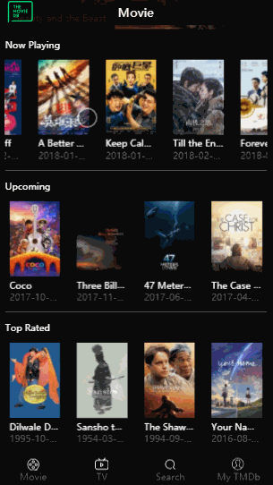
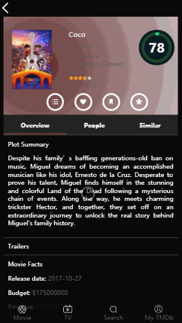
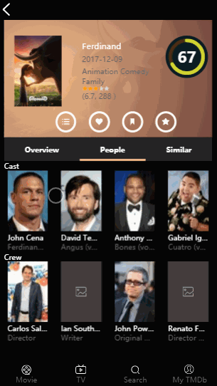
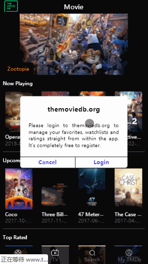
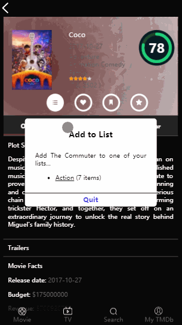
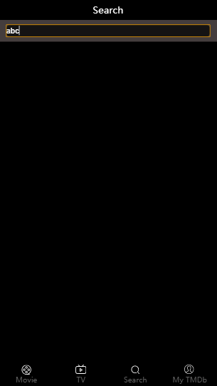

# Vue2-movie
[demo](http://movie.luminqi.com/)（Preview with chrome phone mode）

    
    
     
    
    
     
    
    

## Technology
vue2 + vuex + vue-router + axios + vue-awesome-swiper + node-vibrant

## API
from [TMDb](https://www.themoviedb.org/)

## Features
- [x] Home page -- completed
- [x] Movie detail page -- completed
- [x] People detail page -- completed
- [x] Search page -- completed
- [x] Authenticated through TMDb -- completed
- [x] Rate movie -- completed
- [x] Add movie to favorites, watchlists, private lists -- completed
- [ ] Account detail page -- working on it
- [ ] TV series page -- working on it

